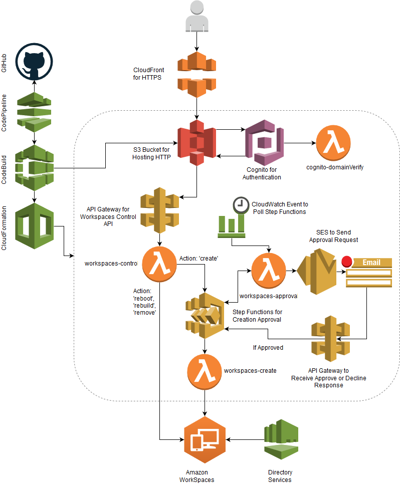
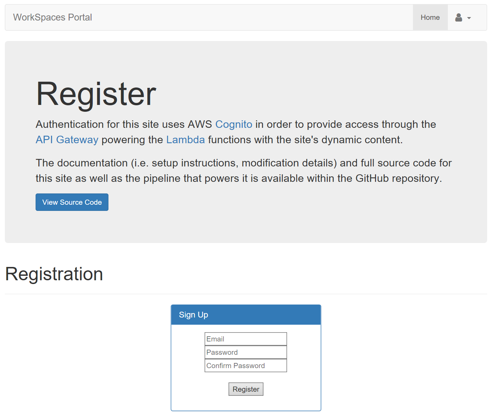
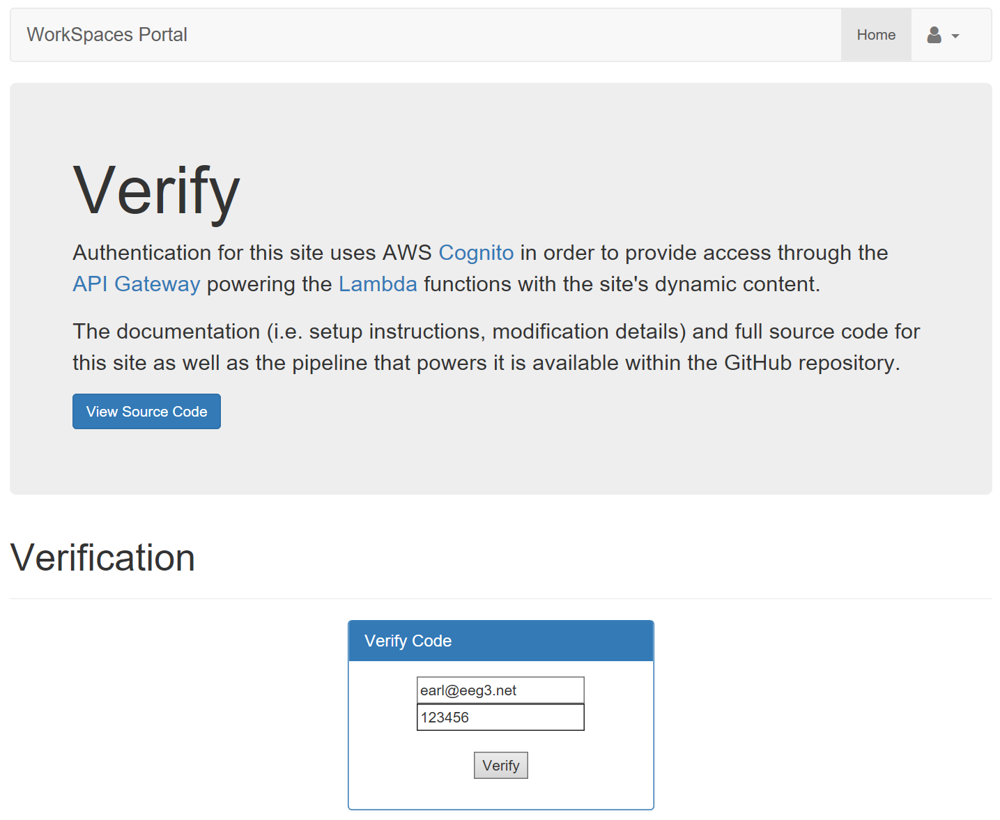
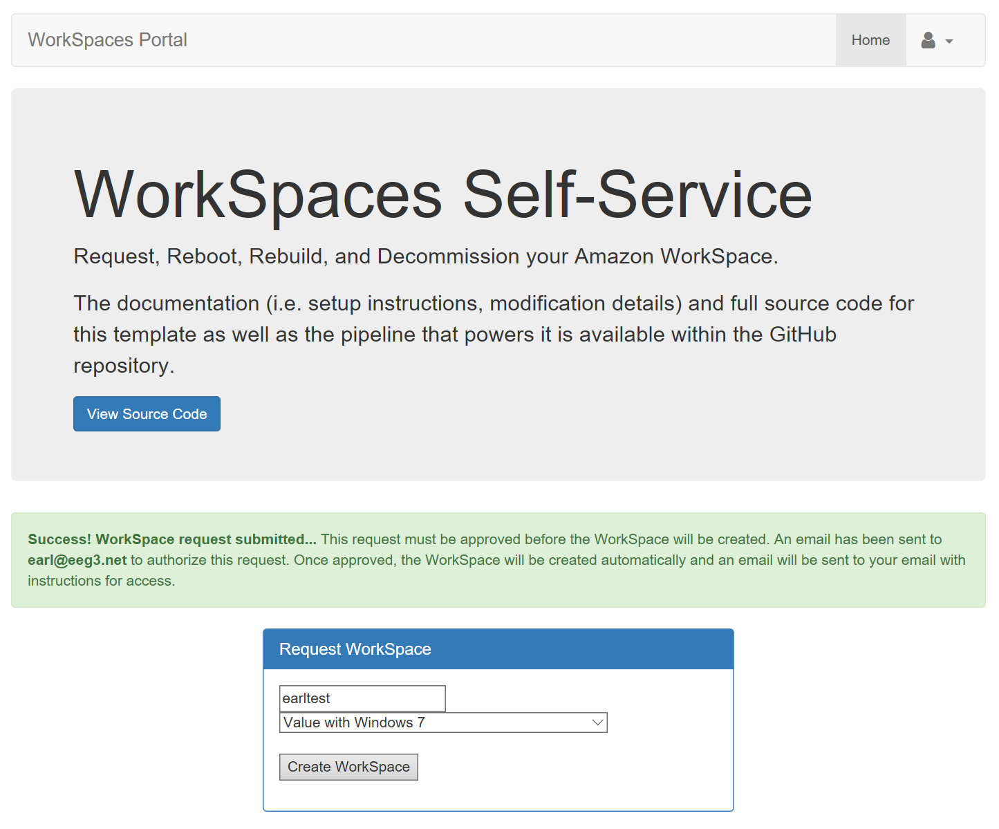
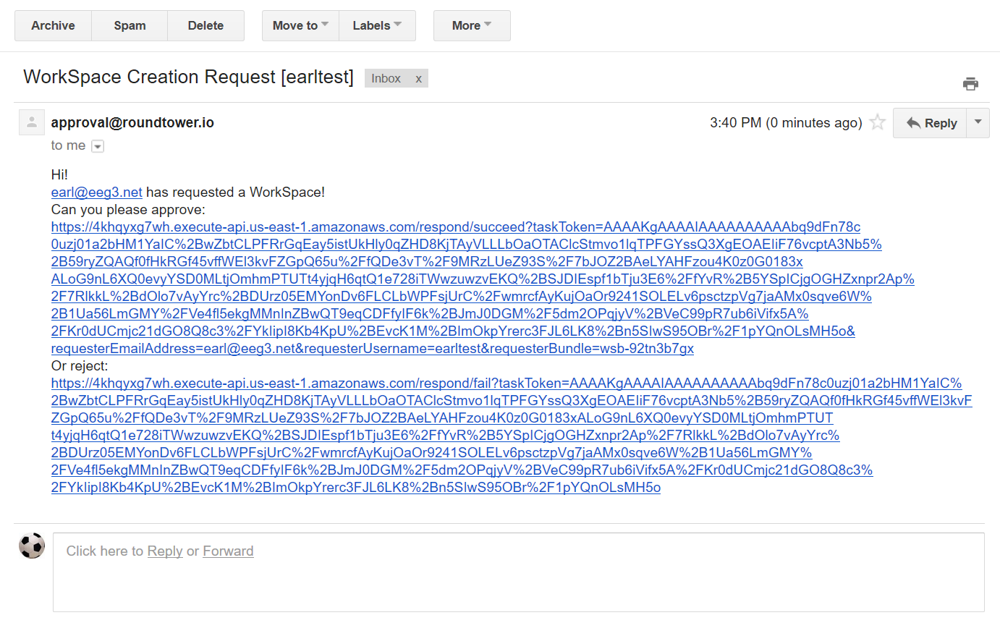
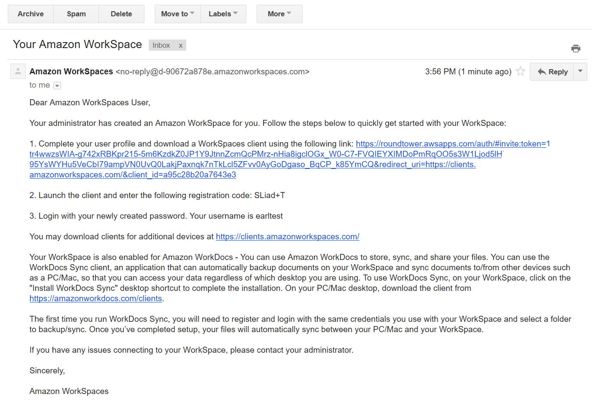
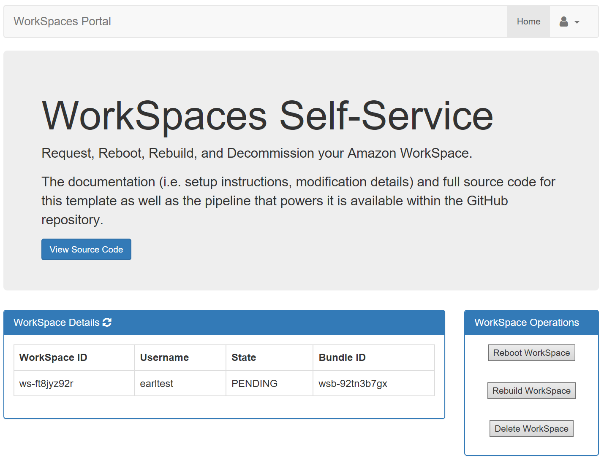

# WorkSpaces Portal

The WorkSpaces Portal provides Self-Service capability to end-users for Amazon WorkSpaces virtual desktops. The portal provides the ability for users to create, rebuild, reboot, and delete their WorkSpace. The application is entirely serverless leveraging AWS Lambda, S3, API Gateway, Step Functions, Cognito, and SES. The application provides continuous deployment through AWS CodePipeline, CodeBuild, CloudFormation with SAM, and GitHub.

## Architecture

### Components Overview

This project leverages the following services:

* [CloudFormation](https://aws.amazon.com/cloudformation/): Used to deploy the entire stack.
* [AWS Serverless Application Model](https://aws.amazon.com/about-aws/whats-new/2016/11/introducing-the-aws-serverless-application-model/): Used to provision Lambda/API Gateway.
* [S3](https://aws.amazon.com/s3/): Used to provide static website hosting and to store our build artifacts.
* [Lambda](https://aws.amazon.com/lambda/): Used to perform Functions-as-a-Service. These can be tested with events in corresponding sample_events/ folder using [lambda-local](https://www.npmjs.com/package/lambda-local).
* [API Gateway](https://aws.amazon.com/api-gateway/): Used to provide an integration point to our Lambda functions.
* [Step Functions](https://aws.amazon.com/step-functions/): Used to provide a State Machine for Approval workflows.
* [Cognito](https://aws.amazon.com/cognito/): Used to provide authentication for our website.
* [SES](https://aws.amazon.com/ses/): Used to send Approval emails.
* [CloudWatch Events](https://docs.aws.amazon.com/AmazonCloudWatch/latest/events/WhatIsCloudWatchEvents.html): Used to set a timer event for Lambda functions.
* [IAM](https://aws.amazon.com/iam/): Provides security controls for our process.
* [CloudFront](https://aws.amazon.com/cloudfront/): Provides HTTPS in front of S3 web site.
* [CodePipeline](https://aws.amazon.com/codepipeline/): Used to provide the pipeline functionality for our CI/CD process.
* [Code Build](https://aws.amazon.com/codebuild/): Used to build the project as part of CodePipeline process. 
* [GitHub](http://www.github.com): Used as the source code repository. Could theoretically be replaced with CodeCommit.
* [Jekyll](http://www.jekyllrb.com): Provides static web site generation to convert the `website/` directory.

## Usage

### User Account Creation

Users can create their accounts through the register page. Anyone with an email on the Approved Domain as specified in the stack can register. 

After registering, users will receive a verification token through email. The user must enter this token on the verification page. Users are automatically redirected to the verify page after registering; however, they can also access it by accessing the site and browsing the verify from the top-right dropdown.

Once verified, the user can sign in to the portal with their created credentials. 

### Creating a WorkSpace

Upon signing in, they will see the WorkSpace Request form as they have not created a WorkSpace yet. They can submit a request which will start the Approval process.

The Approver email as specified within the stack will receive an email with links to Approve or Reject the request.

Upon signing in, they will see the WorkSpace Request form as they have not created a WorkSpace yet.

Once approved, the WorkSpace will begin automatically and immediately.

### Managing a WorkSpace

After the WorkSpace is provisioned, the user will receive an email directly from Amazon with details on how to access their WorkSpace.

They can also begin managing the WorkSpace through the portal: rebuild, reboot, or delete.

## Deployment

### Prerequisites

What things you need to install the software and how to install them

1. The AWS account must be setup for SES for production usage. By default, SES is locked down, and needs to be [moved out of the Amazon SES Sandbox](https://docs.aws.amazon.com/ses/latest/DeveloperGuide/request-production-access.html).
2. Amazon WorkSpaces at the most basic level should be setup. This includes setting up a Directory Services directory and registering it for WorkSpaces. 

### GitHub Creation

1. Create a GitHub repository that mirrors the project repository.
2. If the repository is private, navigate to https://github.com/settings/tokens/new to generate a new Personal Access Token for the pipeline to use.
3. Give the token an appropriate name, and select: `repo` and `admin:repo_hook`.
4. Save the Personal Access Token as it will be entered into the CloudFormation deployment.

### CloudFormation

Deploying the application starts by running the `deploy.json` file inside CloudFormation. The `deploy.json` template will ask for the following parameters:

1. **AppName**: Name of the application that will be used in some components naming scheme.
2. **BucketName**: Name of the S3 Bucket to create that should house the website. This must be unique within the S3 namespace.
3. **CognitoPool**: Name of the Cognito Pool to create to use for authentication purposes.
4. **SAMInputFile**: Serverless transform file. By default, this is the included `wsportal.json` file. (Don't change unless renaming wsportal.json)
5. **SAMOutputFile**: The filename for the output file from the buildspec file. (This doesn't need to be changed unless the artifact file inside the `buildspec.yml` file is changed to a different name.)
6. **CodeBuildImage**: Name of the CodeBuild container image to use. (Don't change unless willing to edit buildspec.yml accordingly.)
7. **GitHubRepName**: Name of the GitHub repo that houses the application code.
8. **GitHubRepoBranch**: Branch of the GitHub repo that houses the application code.
9. **GitHubUser**: GitHub Username.
10. **GitHubToken**: GitHub token to use for authentication to the GitHub account. Configurable inside Github: https://github.com/settings/tokens. Token needs `repo_hook` permissions.

The CloudFormation deployment will notify that it will create IAM Permissions; check the box acknowledging the permissions creation to proceed.

The files referenced (e.g. SAMInputFile) are expected to exist within the GitHub repository. The CloudFormation deployment will warn that it is creating IAM permissions; this is because it creates roles and policies for the pipeline to use when it creates/modifies the child stack.

The initial CloudFormation Stack should be created after `deploy.json` is launched. Once that stack is created, the CodePipeline will then create the child stack after a short period of time. The child stack will be called ``{parent-stack}-serverless-stack``.

Once deployed, the application still requires some additional configuration to work.

### Configuration

After initial deployment, the site will not be fully functional as a few configuration steps must occur. Before proceeding, let CodePipeline perform an initial deployment of the child stack. This is needed to be able to select the Lambda functions created within the API Gateway created in the next step. As soon as the child stack appears within the CloudFormation Stacks list, configuration steps below can begin.

#### Manually Create API Gateway

The Serverless Application Model (SAM) within AWS / CloudFormation does not support enabling CORS directly. As such, if using the API Gateway created through that method, it will not work and will consistently throw CORS errors in the brower. There is an [open issue](https://github.com/awslabs/serverless-application-model/issues/23) on the SAM GitHub repo, and this will hopefully be added soon in the future. 

In the meantime, the API Gateway is built manually. To create the API Gateway manually, follow these steps:

1. Navigate to API Gateway within the AWS Console
2. Select `Create API`
3. Select `New API`
4. Enter an API Name (e.g. workspaces-portal)
5. Select `Create API`
6. Select `Actions` dropdown -> `Create Resource`
7. Enter `workspaces-control` as the Resource name.
8. Check `Enable API Gateway CORS`
9. Select `Create Resource`
10. Select `Actions` dropdown -> `Create Method`
11. From the dropdown under the resource, choose `POST` then select the checkmark.
12. Check `Use Lambda Proxy Integration`
13. Choose the region the environment is deployed within from the dropdown.
14. Select the workspacesControl Lambda that has previously been created by CloudFormation (e.g. appName-serverless-stack-workspacesControl-ABCDEFGH).
15. Select `Save`
16. When the `Add Permissions` pop-up opens, select `OK`.
17. Select `Authorizers` on the left pane under the API.
18. Select `Create New Authorizer`.
19. Enter a name for the Authorizer (e.g. portal_cognito).
20. Under `Type` select Cognito.
21. Select the pool created by CloudFormation (e.g. appName-pool).
22. Under `Token Source`, enter `Authorization`.
23. Select `Create`.
24. Select `Resources` on the left pane under the API.
25. Select `POST` under the `workspaces-control` resource.
26. Select `Method Request`.
27. Select the pencil next to `Authorization` and then select the Authorizer previously created manually (e.g. portal_cognito), and select the checkmark. This may require refreshing the page if only only `AWS_IAM` appears.
28. Select `Action` dropdown -> `Deploy API`.
29. Under `Deployment Stage`, select `[New Stage]`.
30. Under `Stage name`, enter `Prod`.
31. Select `Deploy`.
32. Copy the `Invoke URL` (e.g. https://abcdefgh.execute-api.us-west-2.amazonaws.com/Prod).
33. Paste the `Invoke URL` into `website/js/config.js` within `api.invokeUrl`.

#### Update Web Config with Infrastructure Details

The `config.js` file within `website/js/` needs to be updated so the site knows how to utilize the services (this is a one-time process). 

Within the parent Stack, the Outputs tab should display the following items:

1. **UserPoolClientId**
2. **BucketName**
3. **UserPoolId**
4. **OriginURL**

The `UserPoolClientId` and `UserPoolId` should be placed into the `website/js/config.js` file within the `cognito.userPoolId` and `cognito.userPoolClientId` so that the website knows how to use the services provisioned. If not using `us-east-1`, also change the region within `cognito.region` accordingly.

#### Configure Approval Email Address

For WorkSpace creation approvals, configure the email address within the `approval.email` entry inside `website/js/config.js`. This could be an individual address or a Distribution List.

#### Configure Cognito to use Custom Trigger

*Warning: If this is not configured, anyone can sign up and use the portal.*

Also needed after deployment is to configure Cognito to use the cognito-domainVerify Lambda. To configure manually, follow these steps:

1. Navigate to Cognito within the AWS Console.
2. Select `Manage your User Pools`.
3. Select the pool created by CloudFormation (e.g. appName-pool).
4. Select `Triggers` under `General Settings`.
5. Under `Custom message`, select the cognito-domainVerify Lambda (e.g. AppName-serverless-stack-cogDomainVerify-ABCDEFGH).
6. Select `Save Changes`.

This will enable limiting signups to the email domain configured in the function.

#### Configure App Settings

Edit `wsportal.json` to update the settings specific to your environment. Simply change the `Default` values under the `Parameters` section.

1. **AppName**: This name will be used within the application components.
2. **PortalEmail**: This is the email address that approval emails will be sent from.
3. **ApproverEmail**: This is the email or distribution list that will receive the Approval email messages to approve or reject.
4. **DirectoryServicesId**: This is the Directory Services ID configured within Amazon WorkSpaces.
5. **ApprovedDomain**: This is the domain that can sign up for the portal (e.g. @company.com).

#### Push Changes

Once the `config.js` file is updated, push the change to the GitHub repo; this will automatically update the application with the new config through the pipeline.

#### Create CloudFront Web Distribution to provide HTTPS Support

In order to provide HTTPS coverage for the portal, create a CloudFront Web Distribution. This could be created automatically, but it's unlikely that a *.cloudfront.net address is desired. Instead, that is left up to the administrator to manually deploy using their desired domain name with a related SSL certificate.

### Testing

The site should now work as expected. Browse to the URL defined within `OriginURL` output of the parent CloudFormation stack (e.g. http://s3bucketportalname.s3-website-us-east-1.amazonaws.com), and select "Register" from the top right drop-down (Please note that this will be over HTTP and unencrypted at this point). Enter an email address (within the configured domain inside cogDomainVerify) and password, and select Register. You will receive a verification code from Cognito through email. Once the email is received with the token, select "Verify" from the top right drop-down; on the verify page, enter your email and the verification code provided. At this point, the site will redirect to login. Login with the authentication credentials created. To ensure only users within the specified domain can register for the portal, test registering with an email address on an unapproved domain.

On the main page, the ability to request a WorkSpace should now be displayed. Request a WorkSpace with a user (which must exist within the Directory; only include the username itself without any domain information within it) and select a Bundle to use. It should begin the approval process, and the email address configured for approvals should receive an Approval Request email within approximately 10 minutes, which is within time for the CloudWatch Event that triggers the Lambda function polling Step Functions to run (this can be configured lower within `wsportal.json` for the Lambda function if desired. Approve the request, and the creation process should begin.

The user should receive an email with instructions on how to use their WorkSpace once it finishes provisioning. The user can also log back into the WorkSpaces Portal to try rebooting, rebuilding, or deleting the WorkSpace. Test the ability to perform an activity under WorkSpace Operations on the provisioned WorkSpace.

If everything above works, the application deployed successfully.

## Removal

1. CloudFormation -> Delete Child Stack (e.g. appname-serverless-stack).
2. CloudFormation -> Delete Parent Stack (e.g. appname)
3. Delete all WorkSpaces created (if desired).
4. Delete the Directory Services directory (if desired).
5. Delete the `workspaces-portal` API Gateway.
6. Delete the created S3 Buckets (e.g. AppName-Bucket & serverless-app-<ACCOUNTID>-<REGION>-AppName).
7. Delete the CloudFront Web Distribution.

## Updating

As the website or serverless function is updated, simply perform the modifications within the code and then push them to the GitHub repo. Once checked in to GitHub, CodePipeline will handle the rest automatically. To test this functionality, browse to the CodePipeline page and view the pipeline while pushing a change. The pipeline will show the process from Source -> Build -> Deploy. If there are any failures, they will be visible within the pipeline.

The code for the pipeline resides within the root of the project, and the pipeline itself exists as part of the parent CloudFormation stack:

1. **deploy.json**: Launcher for the core services within CloudFormation (S3, CodePipeline, CodeBuild, Cognito). These are not modified by the pipeline on changes, but it does include setting up the pipeline itself. This is the CloudFormation template to launch to get setup started.
2. **buildspec.yml**: This file is used by CodeBuild to tell it what to do on every build, such as running jekyll and copying the output to S3.
**wsportal.json**: CloudFormation Serverless Transformation template for SAM. This template handles creation of the Lambda functions, Step Functions, and the approval API Gateway.

## Notes

1. If you want to delete the stack, make sure to delete the pipeline-created stack first and then delete the parent stack. If you delete the parent first, the IAM role is deleted and you'll have to tinker around with permissions to get the stack to actually gracefully delete.
2. Some of the IAM permissions may be more liberal than preferred. Please review and edit to match to your security policies as appropriate.

## Authors

* **Earl Gay** - *Initial work* - [eeg3](https://github.com/eeg3)

See also the list of [contributors](https://github.com/eeg3/workspaces-portal/contributors) who participated in this project.

## License

This project is licensed under the [2-Clause BSD License](https://opensource.org/licenses/BSD-2-Clause).

## Acknowledgments

* [AWS Labs: Severless Web Application WorkShop](https://github.com/awslabs/aws-serverless-workshops/tree/master/WebApplication/)
* [AWS Labs: Serverless SAM Farm](https://github.com/awslabs/aws-serverless-samfarm)
* [AWS Compute Blog: Implementing Serverless Manual Approval Steps in AWS Step Functions and Amazon API Gateway](https://aws.amazon.com/blogs/compute/implementing-serverless-manual-approval-steps-in-aws-step-functions-and-amazon-api-gateway/)
